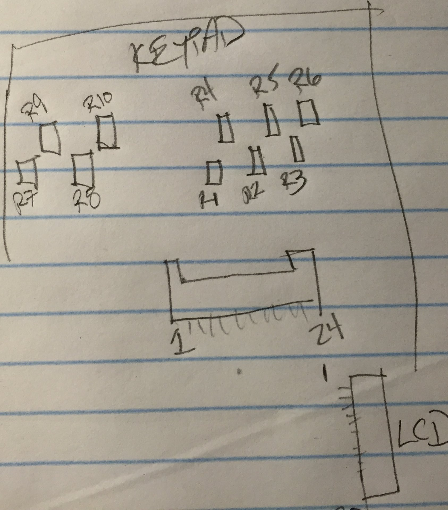

## STM32F405

### Clocks:

PIN 8 - OSC32 IN - low frequency RTC oscillator? not enabled by bootloader

PIN 9 - OSC32 OUT - low frequency RTC oscillator? not enabled by bootloader

PIN 12 - OSC IN  - 8MHz crystal oscillator

PIN 13 - OSC OUT - 8MHz crystal oscillator

-----

### Debug and boot control:

PIN 50 - VDD   - Test Pad

PIN 72 - SWDIO - Test Pad near center screw

PIN 76 - SWCLK - Test Pad @ Pin 76

PIN 94 - BOOT0 - Test Pad

#### Standard 10-pin SWD connector:

PIN 1 - VTREF - to VDD test pad

PIN 2 - SWDIO - to SWDIO test pad

PIN 3 - GND

PIN 4 - SWCLK - to SWCLK test pad

------

### LEDs:

PIN 97 - PE0 - Green LED

PIN 98 - PE1 - Red LED

Both LEDs are driven by a transistor located right next to them on the circuit
board. Use these pins as regular push-pull outputs to drive the transistor gate.

### LCD / Buttons

PIN 59 - PD12 - LCD18

PIN 60 - PD13 - LCD12

PIN 61 - PD14 - Keypad R5

PIN 62 - PD15 - Keypad R7

PIN 63 - PC6 - LCD Backlight Enable

## LCD/Button Board

LCD/Button Board connector is a 24 pin ribbon cable. These signals are described
below.

LCD connector is a 20 pin ribbon cable. These signals are indicated as LCDn.

Keypad resistor names are assigned pretty arbitrarily:

PIN 1 - GND

PIN 2 - GND

PIN 3 - Mic ?

PIN 4 - GND

PIN 5 - GND

PIN 6 - LCD Backlight Enable; STM32 PIN 53 (PC6)

PIN 7 - VCC

PIN 8 - LCD7

PIN 9 - LCD12

PIN 10 - LCD13; STM32 PIN 60 (PD13)

PIN 11 - LCD18; STM32 PIN 59 (PD12)

PIN 12 - LCD19

PIN 13 - Keypad R1

PIN 14 - Keypad R4

PIN 15 - Keypad R2

PIN 16 - Keypad R10

PIN 17 - Keypad R8

PIN 18 - Keypad R5

PIN 19 - Keypad R9; STM32 PIN 62 (PD15)

PIN 20 - Keypad R7; STM32 PIN 61 (PD14)

PIN 21 - NC ?

PIN 22 - Keypad R3

PIN 23 - Keypad R6

PIN 24 - GND

